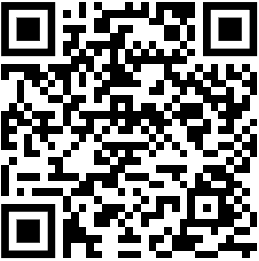

# Main
Welcome to the Villains' Vault, our inner circle, my friend! You're officially part of the "cool kids club." Time to crank up the chill factor and strut your stuff with an air of nonchalance. Remember, sunglasses at night are totally acceptable! 😎

## Disclaimer
Ah, the obligatory disclaimer – the traffic light of serious moments. Alright, let's get this show on the road while still having some fun...

Just to set the record straight, the genius minds behind this website (that's us) want you to know we're as independent as a cat on a hot tin roof. No company's holding our hand or slipping us cash under the table, so any names you spot here aren't part of our secret society.

And while we believe in the power of the internet, we're not internet babysitters. We can't control what the wild and wonderful end users do.

The choices you make with the info you snag from this treasure trove of knowledge are like that weird hat you wore to the family reunion - they're on you, and only you. So, step gingerly through this garden of wisdom, and remember, we're just the tour guides, not the life coaches. Make us proud, or at least don't make us wince!

!!! villains "Take Note!"
    Listen up, internet explorer! Our content is like a delicious buffet - help yourself! Save, download, archive, copy, share, edit, re-post, and even re-upload to your heart's content. Credit is like the cherry on top of our digital sundae, not mandatory but oh-so-sweet if you throw it our way!

    Now, we'd prefer our work not go on a journey to 'claim-it-ville.' But let's face it, the internet's a wild jungle, and sometimes tigers change their stripes. Sharing, though, that's the name of our game. After all, sharing is caring, and we're all about spreading the love!


## Discord
We totally get it, after you've had a whirlwind romance with this awesome site, the next logical step is to join the party in our super exclusive Discord hangout. Our evil lair is polished, prepped, and just waiting for your grand entrance! Think secret trapdoors, plush villainous chairs, and perhaps a pet shark with a laser beam on its head (we can dream, right?). So, fasten your cape and glide on in when you're ready to embrace your inner villain! 😈🦈✨: [https://discord.gg/sfHyZbRnq](https://discord.gg/sfHyZbRnq) 


## Donate

If our digital circus has put a grin on your face, and you've got some [Nano Crypto](https://nano.org/en/nano-foundation) Coins burning a hole in your digital pocket, why not toss a few our way? We're like that street musician playing your favorite tune – we work for tips! Show us some love with your Nano, and we'll keep this party going!

Don't know where to snag Nano? Check out: [https://hub.nano.org/trading](https://hub.nano.org/trading).

Our nano wallet address is:
```
nano_37764i7rbymbq9xwpkixkm1nbkkjy8td3zpht5ot976aw6b9sw4a6kwmrsxz
```



## License

Behold, the grand proclamation! We're setting our creation free, just like a skydiving cat in a superhero cape. Anyone, yes, even your neighbor's dog, can copy, modify, publish, use, compile, sell, or distribute this data in any form – be it the original source code or a snazzy compiled binary. Whether you're here to make a buck or spread some digital love, we've got your back.

Now, in places where copyright laws rule the land, we're tipping our hats to 'em and waving goodbye to our ownership rights. Consider it a gift to humanity, and a not-so-subtle nudge to our future generations. We're laying our claim to this data to rest, for all eternity.

But hey, here's the kicker – this data comes as-is, no fancy warranty dances here. If things go south, you can't point fingers at us. Whether it's a contract conundrum or a tortoise misunderstanding, we won't be footing the bill. It's all part of the wild, wild world of the internet. Enjoy the ride!